# FlightManagement

## Overview

**Flight management** is a system for managing ticket information in ticket sales, scheduling and statistics, reporting staff to the database, managing customers when booking tickets. When booking tickets, customers can pay directly or pay with momo wallet.

## UseCase
<p align="center">
    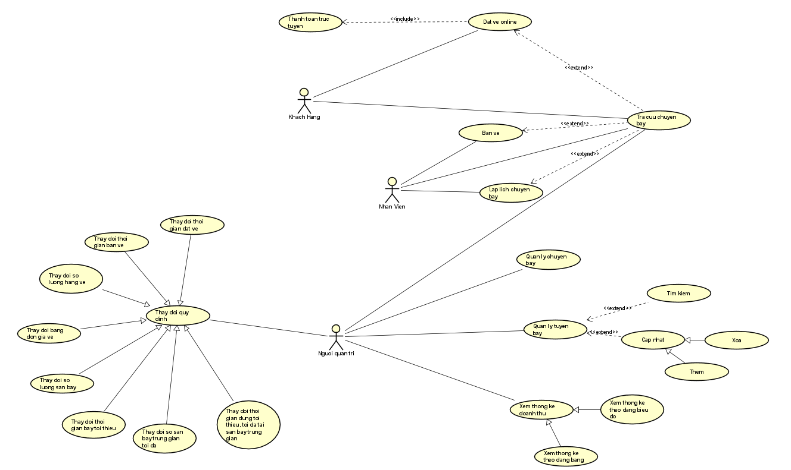
</p>

## Class Diagram
<p align="center">
    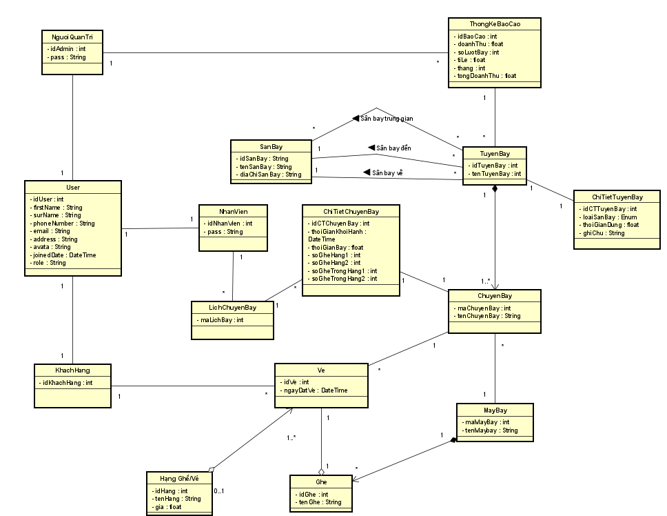
</p>

## Installation
*This readme contains installations and usages for Flask & Bootstrap*

To ensure the project runs, please install [python](https://www.python.org/downloads/)

```bash
# Install packages in requirement.txt
pip install -r requirements.txt
```

```bash
# Install database into MySQL
Step 1: Open MySQL --> create Database (your_name_database)
Step 2: Chose models.py --> run
```
# Database 
<p align="center">
    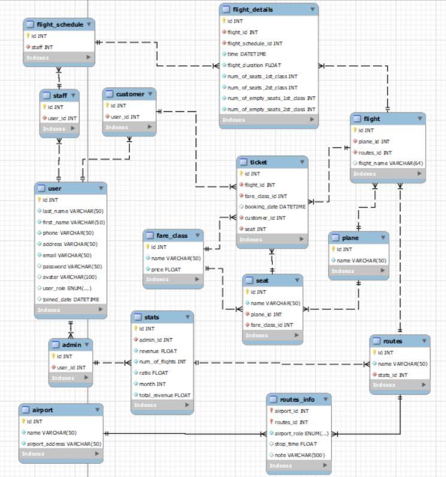
</p>

# Login / Register Interface
<p align="center">
    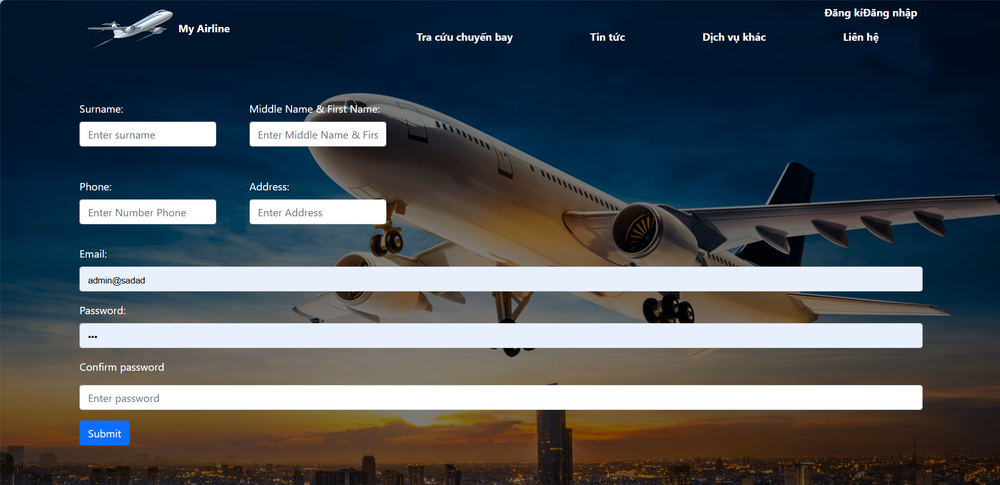
    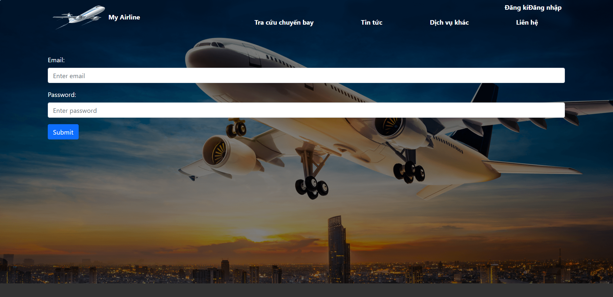
</p>

# Search Ticket Interface
<p align="center">
    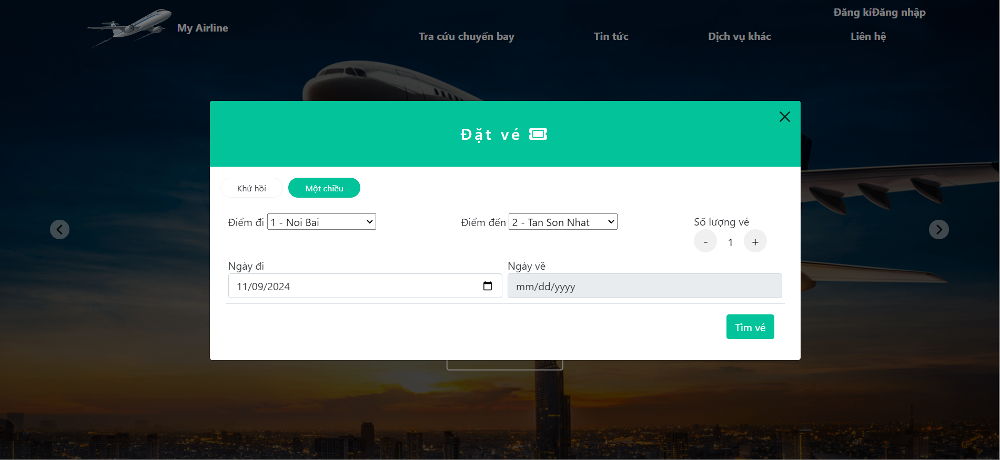
    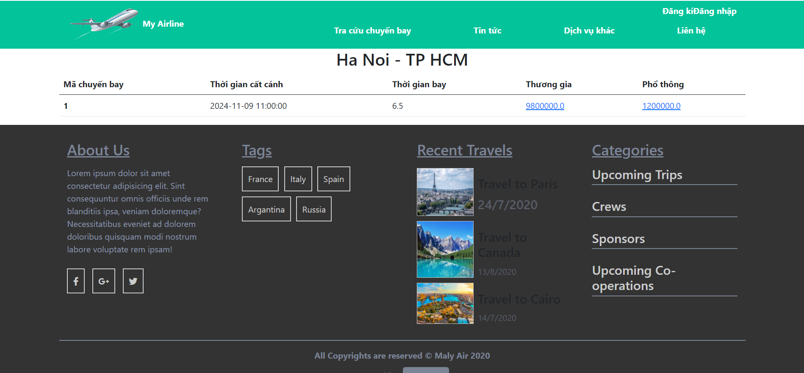
</p>

# Book Tiecket Interface
<p align="center">
    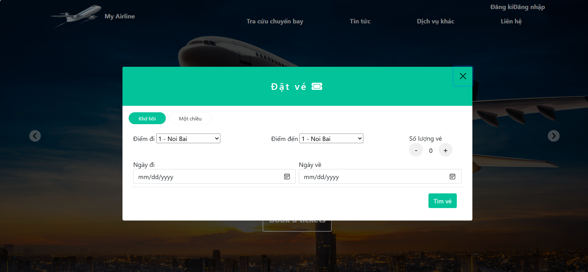
    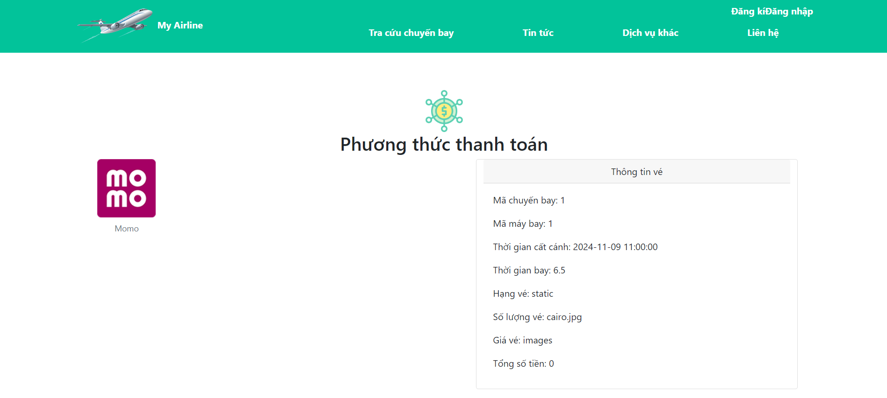
    
</p>

# Ticket management Interface
<p align="center">
    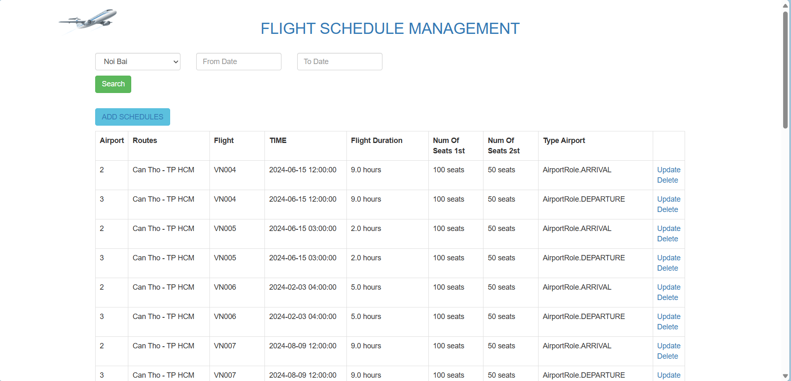
    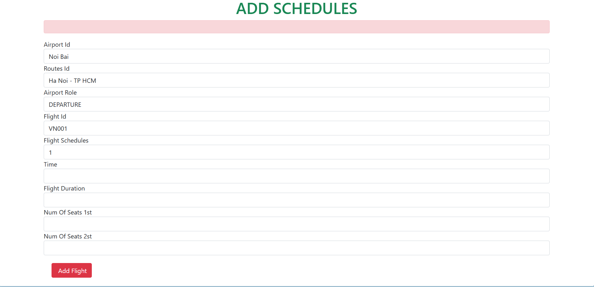
    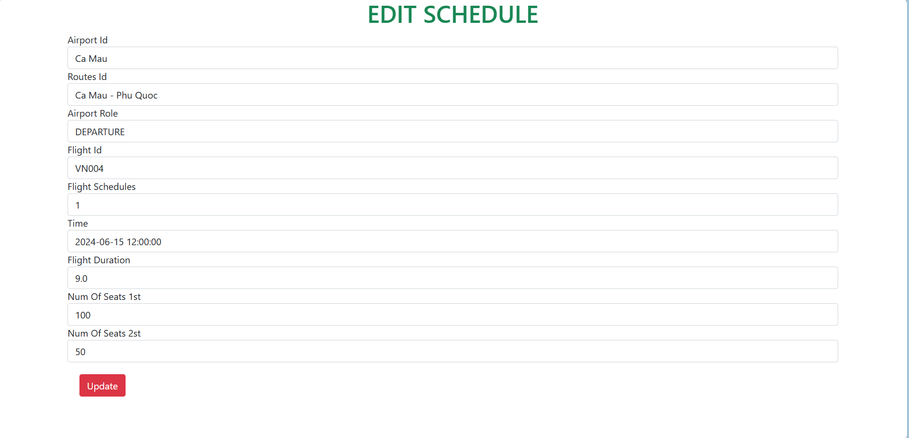
</p>

## Flight Management Reports
You can refer to the report :[DOC Report]([https://www.python.org/downloads/](https://docs.google.com/document/d/1FGd3wd_dzzHcztDyISH6vhUjkIJtFIC0A1mhXVJ2-3Q/edit?fbclid=IwY2xjawE0TE9leHRuA2FlbQIxMAABHUNry9_C_BpR9N-m1053HCNl_M_K_8pVhraR_RH9xCW2gbrfKpiB-IVpjw_aem_oCZMLsqVzz3kr2eEwL8BGg#heading=h.4d34og8))
